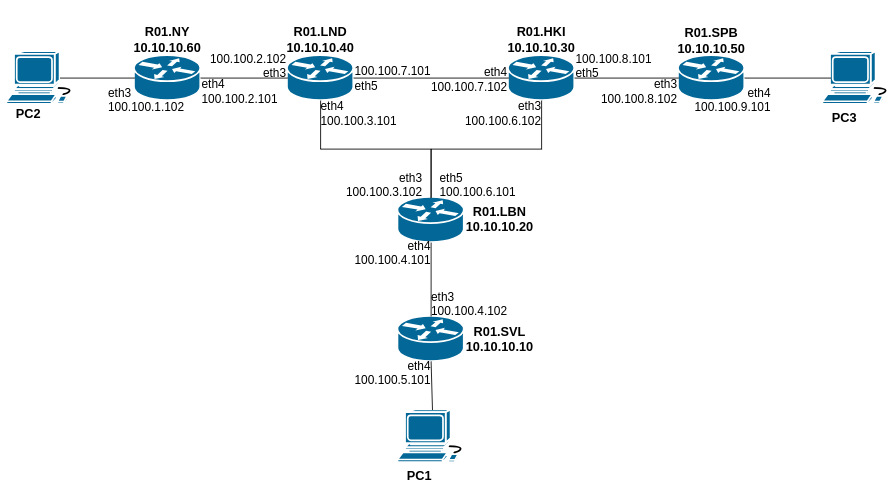
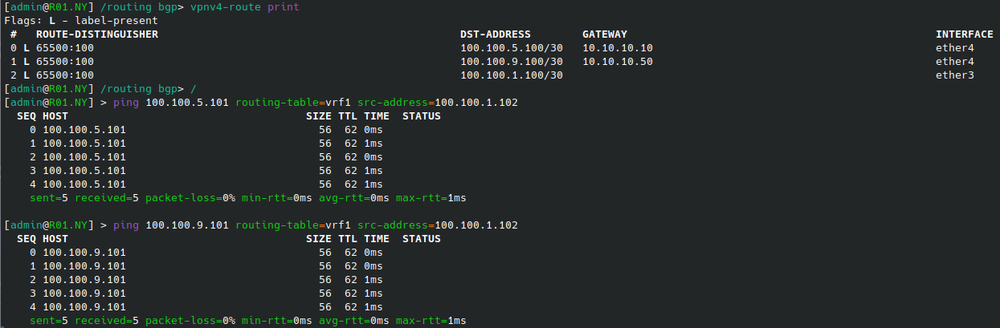
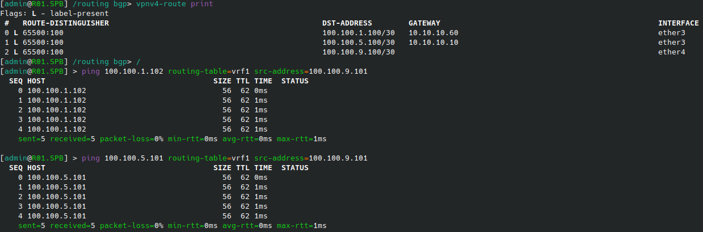
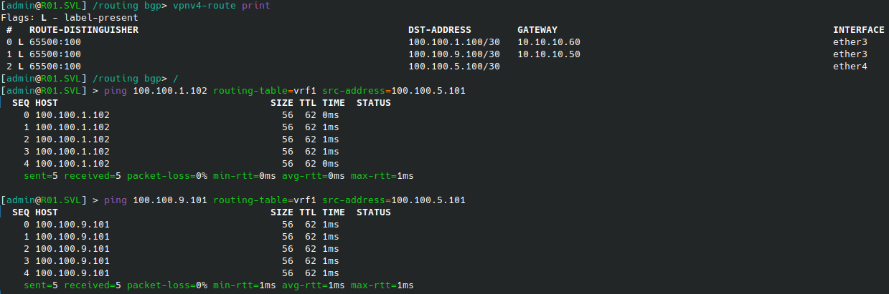
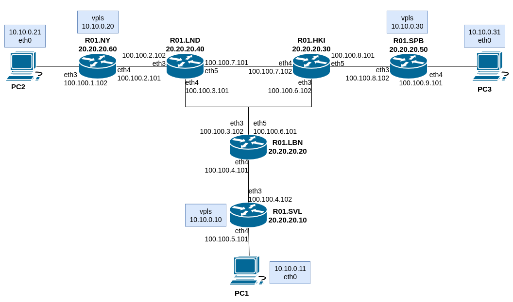
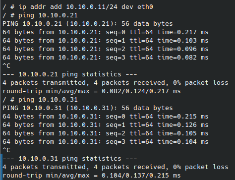
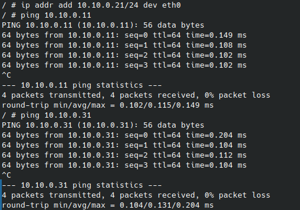

University: [ITMO University](https://itmo.ru/ru/)'

Faculty: [FICT](https://fict.itmo.ru)

Course: [Introduction in routing](https://github.com/itmo-ict-faculty/introduction-in-routing)

Year: 2024/2025

Group: K3321

Author: Sadovaya Anastasia Romanovna

Lab: Lab3

Date of create: 12.01.2025

Date of finished: 15.12.2025

# Лабораторная работ №4 "Эмуляция распределенной корпоративной сети связи, настройка iBGP, организация L3VPN, VPLS"

## Цель:

Изучить протоколы BGP, MPLS и правила организации L3VPN и VPLS.

## Ход работы:

1. Был написан файл lab4.clab.yaml, описывающий все узлы и соединения между ними через mgmt сеть. Наша сеть состоит из 6 роутеров Mikrotik и 3 linux-устройств (симулируют ПК клиентов из условия задания).

### Part 1. 

2.1 Для первой части задания была прописана следующая конфигурация для настройки iBGP RR Cluster, VRF на 3 роутерах, RD и RT:

**R01.SPB**

```
/interface bridge
add name=lb
/routing bgp instance
set default as=65500 router-id=10.10.10.50
/routing ospf instance
set [ find default=yes ] router-id=10.10.10.50
/ip address
add address=10.10.10.50 interface=lb network=10.10.10.50
add address=100.100.8.102/30 interface=ether3 network=100.100.8.100
add address=100.100.9.101/30 interface=ether4 network=100.100.9.100
/ip dhcp-client
add disabled=no interface=ether1
/ip route vrf
add export-route-targets=65500:100 import-route-targets=65500:100 \
    interfaces=ether4 route-distinguisher=65500:100 routing-mark=vrf1
/mpls ldp
set enabled=yes lsr-id=10.10.10.50 transport-address=10.10.10.50
/mpls ldp interface
add interface=ether3
add interface=ether4
/routing bgp instance vrf
add redistribute-connected=yes redistribute-ospf=yes routing-mark=vrf1
/routing bgp peer
add address-families=vpnv4 name=peer1 remote-address=10.10.10.30 remote-as=\
    65500 update-source=lb
/routing ospf network
add area=backbone network=100.100.8.100/30
add area=backbone network=100.100.9.100/30
add area=backbone network=10.10.10.50/32
/system identity
set name=R01.SPB
```

**R01.SVL**

```
/interface bridge
add name=lb
/routing bgp instance
set default as=65500 router-id=10.10.10.10
/routing ospf instance
set [ find default=yes ] router-id=10.10.10.10
/ip address
add address=10.10.10.10 interface=lb network=10.10.10.10
add address=100.100.4.102/30 interface=ether3 network=100.100.4.100
add address=100.100.5.101/30 interface=ether4 network=100.100.5.100
/ip dhcp-client
add disabled=no interface=ether1
/ip route vrf
add export-route-targets=65500:100 import-route-targets=65500:100 \
    interfaces=ether4 route-distinguisher=65500:100 routing-mark=vrf1
/mpls ldp
set enabled=yes lsr-id=10.10.10.10 transport-address=10.10.10.10
/mpls ldp interface
add interface=ether3
add interface=ether4
/routing bgp instance vrf
add redistribute-connected=yes redistribute-ospf=yes routing-mark=vrf1
/routing bgp peer
add address-families=vpnv4 name=peer1 remote-address=10.10.10.20 remote-as=\
    65500 update-source=lb
/routing ospf network
add area=backbone network=100.100.4.100/30
add area=backbone network=100.100.5.100/30
add area=backbone network=10.10.10.10/32
/system identity
set name=R01.SVL
```

**R01.NY**

```
/interface bridge
add name=lb
/routing bgp instance
set default as=65500 router-id=10.10.10.60
/routing ospf instance
set [ find default=yes ] router-id=10.10.10.60
/ip address
add address=10.10.10.60 interface=lb network=10.10.10.60
add address=100.100.2.101/30 interface=ether4 network=100.100.2.100
add address=100.100.1.102/30 interface=ether3 network=100.100.1.100
/ip dhcp-client
add disabled=no interface=ether1
/ip route vrf
add export-route-targets=65500:100 import-route-targets=65500:100 \
    interfaces=ether3 route-distinguisher=65500:100 routing-mark=vrf1
/mpls ldp
set enabled=yes lsr-id=10.10.10.60 transport-address=10.10.10.60
/mpls ldp interface
add interface=ether3
add interface=ether4
/routing bgp instance vrf
add redistribute-connected=yes redistribute-ospf=yes routing-mark=vrf1
/routing bgp peer
add address-families=vpnv4 name=peer1 remote-address=10.10.10.40 remote-as=\
    65500 update-source=lb
/routing ospf network
add area=backbone network=100.100.2.100/30
add area=backbone network=100.100.1.100/30
add area=backbone network=10.10.10.60/32
/system identity
set name=R01.NY
```

**R01.LND**

```
/interface bridge
add name=lb
/routing bgp instance
set default as=65500 router-id=10.10.10.40
/routing ospf instance
set [ find default=yes ] router-id=10.10.10.40
/ip address
add address=10.10.10.40 interface=lb network=10.10.10.40
add address=100.100.2.102/30 interface=ether3 network=100.100.2.100
add address=100.100.3.101/30 interface=ether4 network=100.100.3.100
add address=100.100.7.101/30 interface=ether5 network=100.100.7.100
/ip dhcp-client
add disabled=no interface=ether1
/mpls ldp
set enabled=yes lsr-id=10.10.10.40 transport-address=10.10.10.40
/mpls ldp interface
add interface=ether3
add interface=ether4
add interface=ether5
/routing bgp peer
add address-families=vpnv4 name=peer1 remote-address=10.10.10.60 remote-as=\
    65500 update-source=lb
add address-families=vpnv4 name=peer2 remote-address=10.10.10.30 remote-as=\
    65500 route-reflect=yes update-source=lb
add address-families=vpnv4 name=peer3 remote-address=10.10.10.20 remote-as=\
    65500 route-reflect=yes update-source=lb
/routing ospf network
add area=backbone network=100.100.2.100/30
add area=backbone network=100.100.3.100/30
add area=backbone network=100.100.7.100/30
add area=backbone network=10.10.10.40/32
/system identity
set name=R01.LND
```

**R01.LBN**

```
/interface bridge
add name=lb
/routing bgp instance
set default as=65500 router-id=10.10.10.20
/routing ospf instance
set [ find default=yes ] router-id=10.10.10.20
/ip address
add address=10.10.10.20 interface=lb network=10.10.10.20
add address=100.100.3.102/30 interface=ether3 network=100.100.3.100
add address=100.100.4.101/30 interface=ether4 network=100.100.4.100
add address=100.100.6.101/30 interface=ether5 network=100.100.6.100
/ip dhcp-client
add disabled=no interface=ether1
/mpls ldp
set enabled=yes lsr-id=10.10.10.20 transport-address=10.10.10.20
/mpls ldp interface
add interface=ether3
add interface=ether4
add interface=ether5
/routing bgp peer
add address-families=vpnv4 name=peer1 remote-address=10.10.10.10 remote-as=\
    65500 update-source=lb
add address-families=vpnv4 name=peer2 remote-address=10.10.10.30 remote-as=\
    65500 route-reflect=yes update-source=lb
add address-families=vpnv4 name=peer3 remote-address=10.10.10.40 remote-as=\
    65500 route-reflect=yes update-source=lb
/routing ospf network
add area=backbone network=100.100.3.100/30
add area=backbone network=100.100.4.100/30
add area=backbone network=100.100.6.100/30
add area=backbone network=10.10.10.20/32
/system identity
set name=R01.LBN
```

**R01.HKI**

```
/interface bridge
add name=lb
/routing bgp instance
set default as=65500 router-id=10.10.10.30
/routing ospf instance
set [ find default=yes ] router-id=10.10.10.30
/ip address
add address=10.10.10.30 interface=lb network=10.10.10.30
add address=100.100.6.102/30 interface=ether3 network=100.100.6.100
add address=100.100.7.102/30 interface=ether4 network=100.100.7.100
add address=100.100.8.101/30 interface=ether5 network=100.100.8.101
/ip dhcp-client
add disabled=no interface=ether1
/mpls ldp
set enabled=yes lsr-id=10.10.10.30 transport-address=10.10.10.30
/mpls ldp interface
add interface=ether3
add interface=ether4
add interface=ether5
/routing bgp peer
add address-families=vpnv4 name=peer1 remote-address=10.10.10.50 \
    remote-as=65500 update-source=lb
add address-families=vpnv4 name=peer2 remote-address=10.10.10.40 \
    remote-as=65500 route-reflect=yes update-source=lb
add address-families=vpnv4 name=peer3 remote-address=10.10.10.20 \
    remote-as=65500 route-reflect=yes update-source=lb
/routing ospf network
add area=backbone network=100.100.6.100/30
add area=backbone network=100.100.7.100/30
add area=backbone network=100.100.8.100/30
add area=backbone network=10.10.10.30/32
/system identity
set name=R01.HKI
```

В результате получилась следующая схема сети:



Для проверки связности vrf на всех роутерах посмотрим таблицу /routing bgp vpnv4-route print и пропингуем 2 других роутера

**R01.NY**



**R01.SPB**



**R01.SVL**



### Part 2. 

2.2 Для второй части задания была прописана следующая конфигурация роутеров для настройки VPLS, IP адресации на PC1,2,3 в одной сети:

**R01.SPB**

```
/interface bridge
add name=loopback
add name=vpls protocol-mode=none
/interface ethernet
set [ find default-name=ether1 ] disable-running-check=no
set [ find default-name=ether2 ] disable-running-check=no
set [ find default-name=ether3 ] disable-running-check=no
set [ find default-name=ether4 ] disable-running-check=no
/interface wireless security-profiles
set [ find default=yes ] supplicant-identity=MikroTik
/routing bgp instance
set default as=65500 router-id=20.20.20.50
/routing ospf instance
set [ find default=yes ] router-id=20.20.20.50
/interface bridge port
add bridge=vpls interface=ether4
/interface vpls bgp-vpls
add bridge=vpls export-route-targets=1:2 import-route-targets=1:2 name=vpls \
    route-distinguisher=1:2
/ip address
add address=172.31.255.30/30 interface=ether1 network=172.31.255.28
add address=20.20.20.50 interface=loopback network=20.20.20.50
add address=10.10.0.30/24 interface=vpls network=10.10.0.0
add address=100.100.8.102/30 interface=ether3 network=100.100.8.100
add address=100.100.9.101/30 interface=ether4 network=100.100.9.100
/ip dhcp-client
add disabled=no interface=ether1
/mpls ldp
set enabled=yes lsr-id=20.20.20.50 transport-address=20.20.20.50
/mpls ldp interface
add interface=ether3
add interface=ether4
/routing bgp instance vrf
add redistribute-connected=yes redistribute-ospf=yes routing-mark=vrf1
/routing bgp peer
add address-families=vpnv4 name=peer1 remote-address=20.20.20.30 remote-as=65500 update-source=loopback
/routing ospf network
add area=backbone network=100.100.8.100/30
add area=backbone network=100.100.9.100/30
add area=backbone network=20.20.20.50/32
/system identity
set name=R01.SPB
```

**R01.SVL**

```
/interface bridge
add name=loopback
add name=vpls protocol-mode=none
/interface ethernet
set [ find default-name=ether1 ] disable-running-check=no
set [ find default-name=ether2 ] disable-running-check=no
set [ find default-name=ether3 ] disable-running-check=no
set [ find default-name=ether4 ] disable-running-check=no
/interface wireless security-profiles
set [ find default=yes ] supplicant-identity=MikroTik
/routing bgp instance
set default as=65500 router-id=20.20.20.10
/routing ospf instance
set [ find default=yes ] router-id=20.20.20.10
/interface bridge port
add bridge=vpls interface=ether4
/interface vpls bgp-vpls
add bridge=vpls export-route-targets=1:2 import-route-targets=1:2 name=vpls \
    route-distinguisher=1:2 site-id=4
/ip address
add address=172.31.255.30/30 interface=ether1 network=172.31.255.28
add address=20.20.20.10 interface=loopback network=20.20.20.10
add address=100.100.4.102/30 interface=ether3 network=100.100.4.100
add address=100.100.5.101/30 interface=ether4 network=100.100.5.100
add address=10.10.0.10/24 interface=vpls network=10.10.0.0
/ip dhcp-client
add disabled=no interface=ether1
/mpls ldp
set enabled=yes lsr-id=20.20.20.10 transport-address=20.20.20.10
/mpls ldp interface
add interface=ether3
add interface=ether4
/routing bgp instance vrf
add redistribute-connected=yes redistribute-ospf=yes routing-mark=vrf1
/routing bgp peer
add address-families=vpnv4 name=peer1 remote-address=20.20.20.20 remote-as=\
    65500 update-source=loopback
/routing ospf network
add area=backbone network=100.100.4.100/30
add area=backbone network=100.100.5.100/30
add area=backbone network=20.20.20.10/32
/system identity
set name=R01.SVL
```

**R01.NY**

```
/interface bridge
add name=loopback
add name=vpls protocol-mode=none
/interface ethernet
set [ find default-name=ether1 ] disable-running-check=no
set [ find default-name=ether2 ] disable-running-check=no
set [ find default-name=ether3 ] disable-running-check=no
set [ find default-name=ether4 ] disable-running-check=no
/interface wireless security-profiles
set [ find default=yes ] supplicant-identity=MikroTik
/routing bgp instance
set default as=65500 router-id=20.20.20.60
/routing ospf instance
set [ find default=yes ] router-id=20.20.20.60
/interface bridge port
add bridge=vpls interface=ether3
/interface vpls bgp-vpls
add bridge=vpls export-route-targets=1:2 import-route-targets=1:2 name=vpls \
    route-distinguisher=1:2 site-id=6
/ip address
add address=172.31.255.30/30 interface=ether1 network=172.31.255.28
add address=20.20.20.60 interface=loopback network=20.20.20.60
add address=100.100.2.101/30 interface=ether4 network=100.100.2.100
add address=100.100.1.102/30 interface=ether3 network=100.100.1.100
add address=10.10.0.20/24 interface=vpls network=10.10.0.0
/ip dhcp-client
add disabled=no interface=ether1
/mpls ldp
set enabled=yes lsr-id=20.20.20.60 transport-address=20.20.20.60
/mpls ldp interface
add interface=ether3
add interface=ether4
/routing bgp instance vrf
add redistribute-connected=yes redistribute-ospf=yes routing-mark=vrf1
/routing bgp peer
add address-families=l2vpn name=peer1 remote-address=20.20.20.40 remote-as=\
    65500 update-source=loopback
/routing ospf network
add area=backbone network=100.100.2.100/30
add area=backbone network=100.100.1.100/30
add area=backbone network=20.20.20.60/32
/system identity
set name=R01.NY
```

**R01.LND**

```
/interface bridge
add name=loopback
/interface ethernet
set [ find default-name=ether1 ] disable-running-check=no
set [ find default-name=ether2 ] disable-running-check=no
set [ find default-name=ether3 ] disable-running-check=no
set [ find default-name=ether4 ] disable-running-check=no
set [ find default-name=ether5 ] disable-running-check=no
/interface wireless security-profiles
set [ find default=yes ] supplicant-identity=MikroTik
/routing bgp instance
set default as=65500 router-id=20.20.20.40
/routing ospf instance
set [ find default=yes ] router-id=20.20.20.40
/ip address
add address=172.31.255.30/30 interface=ether1 network=172.31.255.28
add address=20.20.20.40 interface=loopback network=20.20.20.40
add address=100.100.2.102/30 interface=ether3 network=100.100.2.100
add address=100.100.3.101/30 interface=ether4 network=100.200.3.100
add address=100.100.7.101/30 interface=ether5 network=100.100.7.100
/ip dhcp-client
add disabled=no interface=ether1
/mpls ldp
set enabled=yes lsr-id=20.20.20.40 transport-address=20.20.20.40
/mpls ldp interface
add interface=ether3
add interface=ether4
add interface=ether5
/routing bgp peer
add address-families=vpnv4 name=peer1 remote-address=20.20.20.60 remote-as=\
    65500 update-source=loopback
add address-families=vpnv4 name=peer2 remote-address=20.20.20.30 remote-as=\
    65500 route-reflect=yes update-source=loopback
add address-families=vpnv4 name=peer3 remote-address=20.20.20.20 remote-as=\
    65500 route-reflect=yes update-source=loopback
/routing ospf network
add area=backbone network=100.100.2.100/30
add area=backbone network=100.100.3.100/30
add area=backbone network=100.100.7.100/30
add area=backbone network=20.20.20.40/32
/system identity
set name=R01.LND
```

**R01.LBN**

```
/interface bridge
add name=loopback
/interface ethernet
set [ find default-name=ether1 ] disable-running-check=no
set [ find default-name=ether2 ] disable-running-check=no
set [ find default-name=ether3 ] disable-running-check=no
set [ find default-name=ether4 ] disable-running-check=no
set [ find default-name=ether5 ] disable-running-check=no
/interface wireless security-profiles
set [ find default=yes ] supplicant-identity=MikroTik
/routing bgp instance
set default as=65500 router-id=20.20.20.20
/routing ospf instance
set [ find default=yes ] router-id=20.20.20.20
/ip address
add address=172.31.255.30/30 interface=ether1 network=172.31.255.28
add address=20.20.20.20 interface=loopback network=20.20.20.20
add address=100.100.3.102/30 interface=ether3 network=100.100.3.100
add address=100.100.4.101/30 interface=ether4 network=100.100.4.100
add address=100.100.6.101/30 interface=ether5 network=100.100.6.100
/ip dhcp-client
add disabled=no interface=ether1
/mpls ldp
set enabled=yes lsr-id=20.20.20.20 transport-address=20.20.20.20
/mpls ldp interface
add interface=ether3
add interface=ether4
add interface=ether5
/routing bgp peer
add address-families=vpnv4 name=peer1 remote-address=20.20.20.10 remote-as=\
    65500 update-source=loopback
add address-families=vpnv4 name=peer2 remote-address=20.20.20.30 remote-as=\
    65500 route-reflect=yes update-source=loopback
add address-families=vpnv4 name=peer3 remote-address=20.20.20.40 remote-as=\
    65500 route-reflect=yes update-source=loopback
/routing ospf network
add area=backbone network=100.100.3.100/30
add area=backbone network=100.100.4.100/30
add area=backbone network=100.100.6.100/30
add area=backbone network=20.20.20.20/32
/system identity
set name=R01.LBN
```

**R01.HKI**

```
/interface bridge
add name=loopback
/interface ethernet
set [ find default-name=ether1 ] disable-running-check=no
set [ find default-name=ether2 ] disable-running-check=no
set [ find default-name=ether3 ] disable-running-check=no
set [ find default-name=ether4 ] disable-running-check=no
set [ find default-name=ether5 ] disable-running-check=no
/interface wireless security-profiles
set [ find default=yes ] supplicant-identity=MikroTik
/routing bgp instance
set default as=65500 router-id=20.20.20.30
/routing ospf instance
set [ find default=yes ] router-id=20.20.20.30
/ip address
add address=172.31.255.30/30 interface=ether1 network=172.31.255.28
add address=20.20.20.30 interface=loopback network=20.20.20.30
add address=100.100.6.102/30 interface=ether3 network=100.100.6.100
add address=100.100.7.102/30 interface=ether4 network=100.100.7.100
add address=100.100.8.101/30 interface=ether5 network=100.100.8.101
/ip dhcp-client
add disabled=no interface=ether1
/mpls ldp
set enabled=yes lsr-id=20.20.20.30 transport-address=20.20.20.30
/mpls ldp interface
add interface=ether3
add interface=ether4
add interface=ether5
/routing bgp peer
add address-families=vpnv4 name=peer1 remote-address=20.20.20.50 remote-as=65500 update-source=loopback
add address-families=vpnv4 name=peer2 remote-address=20.20.20.40 remote-as=65500 route-reflect=yes update-source=loopback
add address-families=vpnv4 name=peer3 remote-address=20.20.20.20 remote-as=65500 route-reflect=yes update-source=loopback
/routing ospf network
add area=backbone network=100.100.6.100/30
add area=backbone network=100.100.7.100/30
add area=backbone network=100.100.8.100/30
add area=backbone network=20.20.20.30/32
/system identity
set name=R01.HKI
```

Кроме того, самим клиентским устройствам были выданы IP-адреса из одной сети 10.10.0.0/24 в соответствии со схемой:



И чтобы убедиться в работоспособности сети мы пропинговали все PC между собой:

**From PC1 to PC2 and PC3**



**From PC2 to PC3 and PC1**



**From PC3 to PC2 and PC1**


## Вывод:

В результате выполнения лабораторной работы 4 были освоены методы работы с протоколами BGP, MPLS и изучены на практике правила организации L3VPN и VPLS.